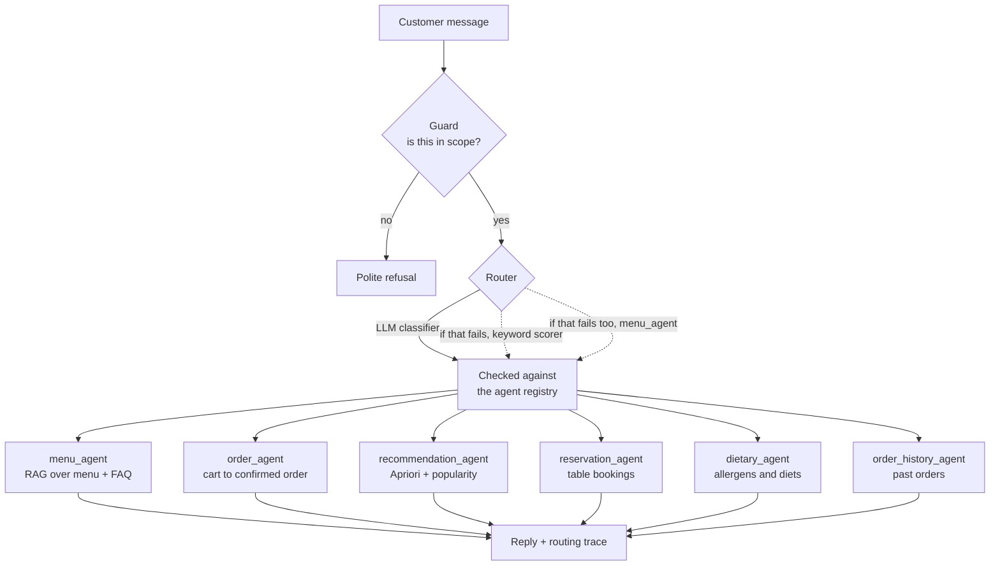

# SufraAI

A chatbot for Sufra, a Lebanese restaurant. Full stack: FastAPI backend, a Next.js web app, and an Expo mobile app. It answers in English or Arabic depending on what you type.

The part worth looking at is the routing. Instead of one giant system prompt trying to do everything, each message gets classified and handed to one of six specialist agents. Each agent has its own prompt, its own data, and its own idea of what a good answer looks like. Menu questions hit the vector store. Order requests go through a confirmation step. Allergy questions get their own agent so they can't be answered casually by the ordering flow.

You can drive the whole thing from a terminal, no server and no frontend:

```bash
python cli.py ask "I'm allergic to sesame, what can I eat?"
```

## How routing works



Three things happen to every message:

**The guard runs first.** It blocks anything off-topic, abusive, or trying to talk the bot out of its instructions. If the guard itself errors out, it lets the message through rather than blocking it. A rate limit shouldn't make the bot go silent.

**Then the classifier picks an agent.** An LLM makes the call, but its answer gets checked against the registry of agents that actually exist. If it hallucinates an agent name, or the API is down, or there's no key configured, a keyword scorer takes over. That scorer is dumb but deterministic, which means the routing tests run without a network connection and the bot keeps working when Groq doesn't.

**Then the specialist answers**, with the conversation history and whatever's in the user's profile. The reply comes back with a trace: which agent got it, which stage decided, how confident, and why.

A couple of decisions that took some thought:

- If someone mentions an allergy, the dietary agent answers even when the message also looks like an order ("I'd like the hummus but I'm allergic to sesame"). Both the classifier prompt and the keyword scorer enforce this. Getting an allergen answer from the order-taking flow is the kind of bug that hurts someone.
- The model never writes to the database on its own say-so. When the order agent decides a customer has confirmed, every item ID and price gets looked up again in `menu.json` before anything is saved. If the model invents a dish, validation drops it instead of creating an order for food that doesn't exist.

## What it does

- Menu and FAQ questions answered from a vector store (ChromaDB, `all-MiniLM-L6-v2`) over 40 items and 15 FAQs, so it doesn't invent dishes or prices
- Order taking with a confirmation step and server-side validation
- Recommendations from an Apriori model trained on a transactions dataset, falling back to popularity when there's nothing in the cart
- Table reservations
- Allergen and dietary guidance that respects the user's saved profile
- Order history and reorder
- Arabic replies, either detected from the message or set in the profile
- Signup and login with bcrypt, plus per-user favourites and a usual-order preset

## Stack

Backend is FastAPI with Pydantic v2. Agents run on Groq (`llama-3.1-8b-instant`). Retrieval is ChromaDB with sentence-transformers. Recommendations come from Apriori association rules trained offline in `backend/recomendation_engine_training.ipynb`. Users, auth, and orders live in SQLite; promotions and reservations sit in a small JSON store.

Web is Next.js 15 with React 19, Tailwind, TanStack Query, and Zustand. Mobile is Expo and React Native with i18next.

## Running it

Backend:

```bash
cd backend
python -m venv venv
venv\Scripts\activate
pip install -r requirements.txt
```

Copy the env template and drop in a [Groq key](https://console.groq.com/keys):

```bash
copy .env.example .env
```

```bash
uvicorn main:app --reload
```

Docs at http://127.0.0.1:8000/docs. The first start is slow because it downloads the embedding model and builds the index. After that it's cached.

Web app:

```bash
cd app/web
npm install
npm run dev
```

Mobile app:

```bash
cd app/mobile
npm install
npx expo start
```

## The CLI

I got tired of spinning up a server and clicking through a UI every time I wanted to check whether a message routed correctly, so the CLI talks to the agents directly.

| Command | What it does |
|---|---|
| `python cli.py agents` | List the agents the router picks from |
| `python cli.py route "book a table for 8"` | Show which agent would handle a message, without calling it |
| `python cli.py ask "what's in the fattoush?"` | Send one message through the whole pipeline |
| `python cli.py chat` | Interactive session with history (`/trace`, `/reset`, `/agents`, `/quit`) |
| `python cli.py test-routing` | Run the labelled routing cases and print a pass/fail table |

Add `--offline` to skip the LLM entirely and exercise the keyword router. Useful when you have no key, no signal, or just want deterministic output. `--json` gives you parseable output, `--user-id` runs as a specific profile, and `--with-guard` also checks that off-topic messages get blocked.

```bash
python cli.py test-routing --offline
```

```
+-----+-------------------------------+---------------+---------------+-----------+------+
| OK  | Can I book a table for 8?     | reservation.. | reservation.. | heuristic | 0.90 |
| OK  | Which dishes are gluten free? | dietary_agent | dietary_agent | heuristic | 0.90 |
| OK  | What did I order last time?   | order_histo.. | order_histo.. | heuristic | 0.85 |
+-----+-------------------------------+---------------+---------------+-----------+------+
24/24 routed correctly
```

`ask` prints the reply along with the trace that produced it:

```
> what did I order last time?
+- order_history_agent --------------------------------+
| Your last order was: Zaatar Mana'eesh x2.            |
+------------------------------------------------------+
+- routing --------------------------------------------+
|           agent  order_history_agent                 |
|      decided by  LLM classifier                      |
|      confidence  0.94                                |
|  keyword scores  order_history_agent=4.5             |
+------------------------------------------------------+
```

## Tests

Plain `unittest`, no extra dependencies, LLM fully mocked so nothing hits the network:

```bash
cd backend
python -m unittest discover -s tests -v
```

They cover the classifier path, rejecting hallucinated agent names, the guard blocking and the guard failing open, the keyword fallback, allergy precedence, JSON repair on messy model output, and order item validation.

## API

| Method | Endpoint | Notes |
|---|---|---|
| `POST` | `/chat` | Full pipeline. Returns the reply and its routing trace |
| `POST` | `/chat/route` | Classify a message without calling the agent |
| `GET` | `/chat/agents` | The agent registry |
| `POST` | `/chat/stream` | SSE, token by token |
| `GET` | `/menu/`, `/menu/availability`, `/menu/categories`, `/menu/{category}` | Menu |
| `GET` `POST` | `/orders/`, `/orders/history`, `/orders/{id}`, `/orders/reorder` | Orders |
| `POST` | `/reservations/` | Reservations, optionally with a preorder |
| `GET` | `/recommendations/` | Apriori plus popularity |
| `GET` `PUT` | `/user/profile` | Profile, language, dietary settings |
| `POST` | `/auth/signup`, `/auth/login` | Auth |
| `GET` `POST` `DELETE` | `/favorites/` | Favourites |

```bash
curl -X POST http://127.0.0.1:8000/chat -H "Content-Type: application/json" -d "{\"message\": \"what do you recommend with hummus?\", \"user_id\": \"guest\"}"
```

```json
{
  "response": "...",
  "routing": {
    "agent": "recommendation_agent",
    "stage": "llm",
    "confidence": 0.94,
    "reasoning": "the customer is asking for a pairing suggestion"
  }
}
```

## Layout

```
SufraAI/
├── backend/
│   ├── agents/
│   │   ├── router_agent.py       registry, guard -> classify -> dispatch
│   │   ├── guard_agent.py        scope and safety filter
│   │   ├── menu_agent.py         RAG over menu + FAQ
│   │   ├── order_agent.py        order taking, server-side validation
│   │   ├── recommendation_agent.py
│   │   ├── reservation_agent.py
│   │   ├── dietary_agent.py
│   │   ├── order_history_agent.py
│   │   └── agent_utilities.py    LLM client, JSON repair, language, menu cache
│   ├── routers/                  FastAPI routes
│   ├── db/                       SQLite layers
│   ├── data/                     menu.json, faq.json, trained recommendation data
│   ├── tests/test_routing.py
│   ├── cli.py
│   ├── rag.py
│   └── main.py
└── app/
    ├── web/                      Next.js
    └── mobile/                   Expo / React Native
```
